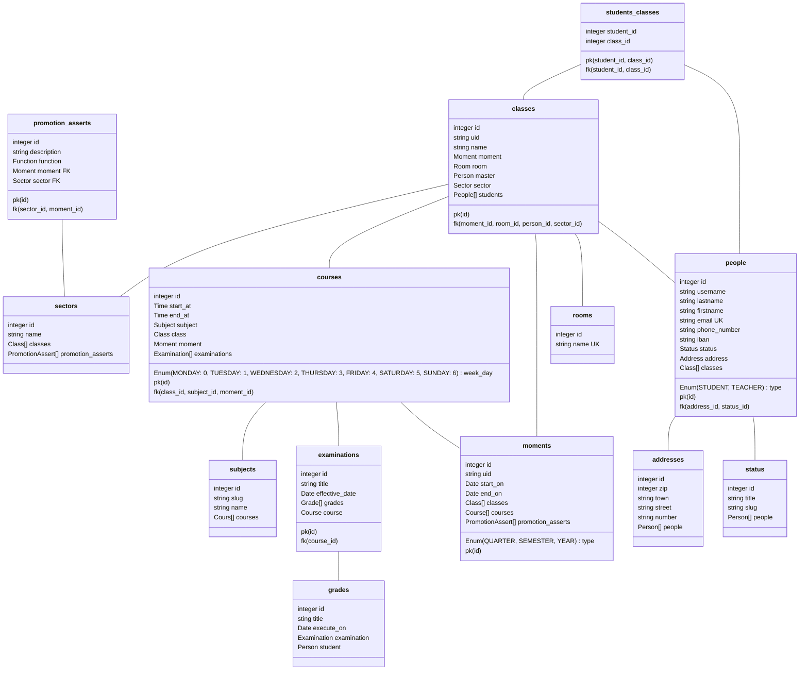

# Instructions

L'école doit gérer :

- des élèves
    - horaire de la semaine par semestre
- Des enseignants
    - Planning
- Des cours
    - Horaire
    - Notes
    - Semestre

Il faut faire attention aux élèves qui arrête leur formation en cours de route. Il faut aussi porter une
attention particulière aux élèves qui double.

# Informations client

### Structure des données métiers

- Étudiants
    - horaire par semestre
    - nom
    - prénom
    - adresse
    - email
    - téléphone
    - statut ⇒ en cours, terminé, abandonné…
- Enseignants
    - planning
    - nom
    - prénom
    - adresse
    - email
    - téléphone
    - statut -> retraite, pas de cours, en fonction…
    - iban
- Cours
    - enseignant
    - nom
    - description
    - semestre ou il est donnée (évolutif)
    - horaire
- Notes

  Valeur

  Date de passage

  Cours

  Étudiant

## Questions/réponses

### Q1
#### Est-ce que tous les élève au sein d'un classe on FORCEMENT les même leçon ?

> Oui


### Q2
#### Avez-vous des cas spéciaux que vous voulez que nous tenions compte ?

> Non
>

### Q3
#### Des semaines spéciales

> Non
>

### Q4
#### Des appuis (évènement en dehors des cours programmés)

> Non
>


### Q5
#### Des fonctionnalité que vous voulez que la future application soit capable de faire ? _Exemple l’ajout de devoirs_

> Non


### Q6
#### Seulement 3 Entité ? par de salle, bâtiment ou autre ?

> Oui, les salles en sachant qu’une classe à toujours la même salle. On doit pouvoir changer la salle d’une classe. Pas
> de bâtiment.


### Q7
#### Voulez-vous un historique ?

> Oui
>


### Q8
#### Comment fonctionne les promotion ? trimestre semestre libre ?

> Par semestre et moyenne de toute les groupes de matière générale supérieurs à 4 et modules validés
>


### Q9
#### Est-ce que vous voulez que les conditions de promotion soie stockée dans la db ?

> Oui stocké les fonction, et garder un historique
>


### Q10
#### Est-ce que l’enseignant est déterminé par la branche ou par la leçon ?

> Toujours le même enseignant par branche/cours mais peut être changé
>


### Q11
#### Voulez-vous pouvoir attribuer certaine chose à une période spécifique ? (devoir)

> Non
>

### Q12
#### Voulez-vous que certaines informations administrative tel que le nombre de période requis de tel cours soient stockées ?

>
>


### Q13
#### Voulez-vous que les conditions de promotions dispose d’un champs d’explication de la fonction

>
>


### Q14
#### Les vacances sont-elles stockées ? Ou l’on part du principe que les semaines de vacances n’existent pas ?

>
>


### Autres informations

L’horaire n’est pas stocké à proprement parlé il peut générer sur la base des informations stockée en base de donnée.

chaque trimestre est parfaitement identique sur toute les semaines qui la compose.(semaine type)

## Conclusion par question

Conséquence sur la base de donnée de chaque réponse.

### [#1](#Q1)

Cela implique que les cours peuvent êtres directement reliés à la classe d’un étudiant.

### [#2](#Q2), [#3](#Q3) et [#4](#Q4)

En résulte la création d’un horaire d’une semaine type.

### [#6](#Q6)

Implique la création d’une liste des salles ainsi que d’une liaison aux classes.

### [#7](#Q7)

Implique énormément d’aménagements.

Une liste non exhaustive :

- La classe ne pourra pas être la même pour les prochains élèves

    | Nom de la classe | Année scolaire | Étudiants                   |
    |------------------|----------------|-----------------------------|
    | SI-T1a           | 21-22          | Jean-Pierre, Paul et Jaques |
    | SI-T1a           | 22-23          | Arnaud, Julie et Anthony    |

- Les conditions de promotions devrons êtres unique par “promotions”

| Fonction condition de promotion                                                | Année scolaire |
|--------------------------------------------------------------------------------|----------------|


### [#8](https://www.notion.so/DB-ES-33b7dc96b66f439d8e6e901289a43280?pvs=21) et [#9](https://www.notion.so/DB-ES-33b7dc96b66f439d8e6e901289a43280?pvs=21)

Une table contenant la fonction de calcul vérification si l’étudiant est apte à être promu. Devant être séparé par
année.

### [#10](https://www.notion.so/DB-ES-33b7dc96b66f439d8e6e901289a43280?pvs=21)

Le cours programmé définit l’enseignant des périodes.

# Pseudo SQL

### Récupération de l’horaire

On récupère le nom, l’heure de début, l’heure de fin, la date du cours, les informations de la classe, les informations
de la salle de cours, les informations de l’enseignant. Depuis Cours en fonction de la classe et du trimestre

```sql
SELECT name, start_at, end_at, cours_date, class, class.classroom as classroom, teacher
FROM Cours
WHERE class.name = ""
```

# Retours

> Attention aux types de formations.

> MCD : Jusitifier les relations en particuliers les modifications.

## Modifications

### Ajout du type de formation (filières)

Ajout d'une table et de deux relations


### Rassemblement des tables enseignants et des étudiants

Précédement la séparation entre un étudiant et un enseignant, était faite en avec deux tables séparée. Chaqu'une de ces table disposaient d'une relation avec une table par type de personne avec leurs status. Cette erreur a été causée par une approche trop dévleloppement orientée objet. Voici la version mise à jour de cette relation.


### Revision de la gestion du temps

Précédement, la prériode durant la quelle un élément se passe, était définit dans les tables directement. Afin d'avoir un système générique de gestion des periodes, j'ai décider d'ajouter une table `Moments` qui contient une date de début une date de fin ainsi qu'un type qui est un enum avec les cas suivants `ANNÉE`, `SEMESTRE` et `TRIMESTRE`.


# Modèle Logique de Donnée



