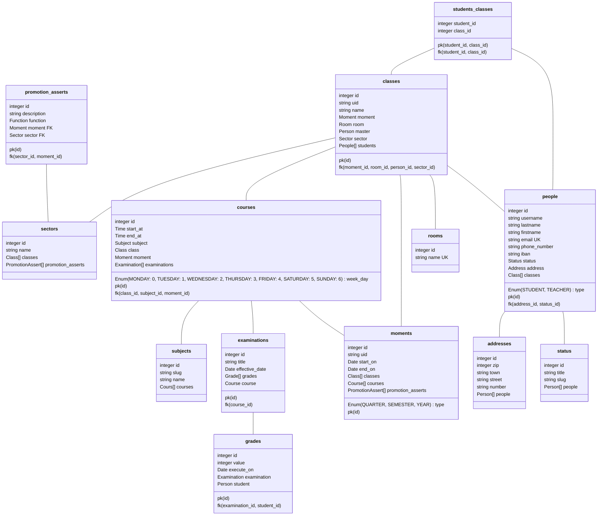

# MLD

```mermaid
classDiagram
    promotion_asserts -- sectors
    courses -- subjects
    courses -- examinations
    courses -- moments
    classes -- people
    classes -- rooms
    classes -- moments
    classes -- sectors
    people -- addresses
    people -- status
    students_classes -- classes
    students_classes -- people
    examinations -- grades
    classes -- courses
    class addresses {
        integer id
        integer zip
        string town
        string street
        string number

        Person[] people
    }
    class rooms {
        integer id
        string name UK
    }
    class classes {
        integer id
        string uid
        string name
        Moment moment
        Room room
        Person master
        Sector sector
        People[] students
        pk(id)
        fk(moment_id, room_id, person_id, sector_id)
    }
    class people {
        integer id
        string username
        string lastname
        string firstname
        string email UK
        string phone_number
        string iban

        Status status
        Address address
        Class[] classes
        Enum(STUDENT, TEACHER) type
        pk(id)
        fk(address_id, status_id)
    }
    class status {
        integer id
        string title
        string slug

        Person[] people
    }
    class students_classes {
        integer student_id
        integer class_id

        pk(student_id, class_id)
        fk(student_id, class_id)
    }
    class sectors {
        integer id
        string name
        Class[] classes
        PromotionAssert[] promotion_asserts
    }
    class moments {
        integer id
        string uid
        Date start_on
        Date end_on

        Class[] classes
        Course[] courses
        PromotionAssert[] promotion_asserts
        Enum(QUARTER, SEMESTER, YEAR) type
        pk(id)
    }
    class subjects {
        integer id
        string slug
        string name

        Cours[] courses
    }
    class courses {
        integer id
        Time start_at
        Time end_at

        Subject subject
        Class class
        Moment moment
        Examination[] examinations
        Enum(MONDAY: 0, TUESDAY: 1, WEDNESDAY: 2, THURSDAY: 3, FRIDAY: 4, SATURDAY: 5, SUNDAY: 6) week_day
        pk(id)
        fk(class_id, subject_id, moment_id)
    }
    class examinations {
        integer id
        string title
        Date effective_date

        Grade[] grades
        Course course
        pk(id)
        fk(course_id)
    }
    class grades {
        integer id
        integer value
        Date execute_on

        Examination examination
        Person student
        pk(id)
        fk(examination_id, student_id)
    }
    class promotion_asserts {
        integer id
        string description
        Function function

        Moment moment FK
        Sector sector FK
        pk(id)
        fk(sector_id, moment_id)
    }
```